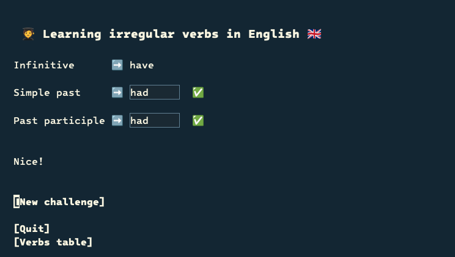
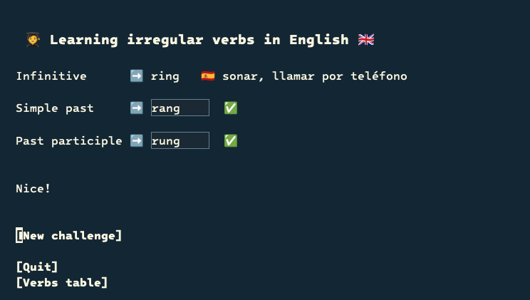

# Lirve: Learn irregular English verbs in Emacs

Lirve helps you learn irregular verbs by repeating the verbs you fail at regular intervals. In other words: Lirve remembers your mistakes and repeats the challenge in the future.



## Install

### MELPA

```
M-x package-install RET lirve RET
```

And add the following to your `init.el`:

```elisp
(require 'lirve)
```

### use-package

Requires Emacs 30 or later. Add the following to your `init.el`:

```elisp
(use-package lirve
  :vc ( :url "https://git.andros.dev/andros/lirve.el"
        :rev :newest))
```

## Configure (Optional)

Shows the translation of the verb when resolving or failing.



Only available in Spanish (at the moment).

```elisp
(setq lirve-translation-language 'es)
```

## Usage

```
M-x lirve
```

I also recommend creating a function to make it easier to remember the command.

```elisp
(defun learning-irregular-verbs-in-english ()
  "Start Lirve."
  (interactive)
  (lirve))
```

```
M-x learning-irregular-verbs-in-english
```

## Verbs table

You can browse the full list of verbs in a read-only table:

```
M-x lirve-verbs-table
```

Click on a column header to sort by it, and press `q` to quit. If `lirve-translation-language` is set, the table includes a fourth column with the translations.

## Controls

| Key | Description |
| --- | --- |
| `TAB` | Move to the next field |
| `S-<tab>` | Move to the previous field |
| `RET` | Click on the button |

## Contributing

Contributions are welcome! Please see the [contribution guidelines](https://git.andros.dev/andros/contribute) for instructions on how to submit issues or pull requests.

If you want to add more languages, make a PR with the translations in `lirve-verbs.el`.

For example, the verb `beat` in Italian and Spanish:

```elisp
(
    (infinitive . "beat")
    (simple-past . "beat")
    (past-participle . "beaten")
    (translations
        (es . "golpear")
        (it . "colpire")))
```
